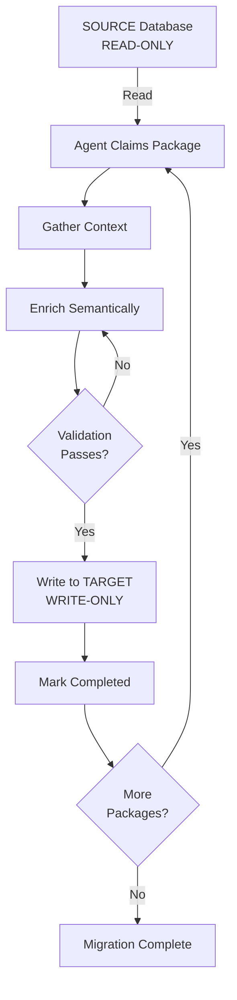

# Graph Semantic Enrichment Skills System

A Claude Code Skills system for orchestrating semantic enrichment of Neo4j graph database migration with strict SOURCE/TARGET separation.

## Overview

This skill enables AI agents to systematically enrich a Neo4j graph database by migrating nodes from a READ-ONLY source database to a WRITE-ONLY target database with semantic enhancement.

### Key Features

- **Safe Database Separation**: SOURCE is physically read-only, TARGET is write-only
- **3-Phasen Agent Loop**: Gather → Act → Verify workflow
- **Package-Based Claiming**: Atomic work distribution for 8 parallel agents
- **Two-Tier Validation**: Structural constraints + semantic quality checks
- **Hybrid Tool Pattern**: CLI templates + agent properties for safety
- **Progressive Disclosure**: Load documentation as needed

### Scope

- **Nodes**: 259 MetaAttributes + 3,255 Enumerations + support nodes
- **Parallel Processing**: 8 agents working simultaneously
- **Duration**: ~18-24 hours total with parallel execution
- **Quality**: All nodes receive full semantic enrichment

## Prerequisites

### Database Access

You need access to two Neo4j databases:

1. **SOURCE Database** (Test Propagation)
   - Instance ID: 025a2013
   - Access: READ-ONLY
   - Purpose: Reference data with mixed quality

2. **TARGET Database** (Graph Rebuild 202511)
   - Instance ID: [Create new instance]
   - Access: WRITE-ONLY
   - Purpose: Production-ready enriched graph

### Environment Variables

```bash
# SOURCE Database (READ-ONLY)
export NEO4J_SOURCE_URI="neo4j+s://025a2013.databases.neo4j.io"
export NEO4J_SOURCE_USER="neo4j"
export NEO4J_SOURCE_PASSWORD="[password]"

# TARGET Database (WRITE-ONLY)
export NEO4J_TARGET_URI="neo4j+s://[target-id].databases.neo4j.io"
export NEO4J_TARGET_USER="neo4j"
export NEO4J_TARGET_PASSWORD="[password]"
```

### Python Dependencies

```bash
pip install -r scripts/requirements.txt
```

Required packages:
- neo4j>=5.25.0
- pydantic>=2.11.7
- python-dotenv>=1.1.1
- click>=8.2.1

## Quick Start

### For AI Agents

1. **Read the skill guide**:
   ```
   Read SKILL.md for the 3-Phasen Loop workflow
   ```

2. **Claim work packages**:
   ```python
   packages = claim_packages(agent_id="Agent_A1", num_packages=2)
   ```

3. **Process each package**:
   ```python
   for package in packages:
       # Phase 1: Gather from SOURCE
       source_data = read_source_node(package.meta_id, "concise")

       # Phase 2: Enrich and write to TARGET
       enriched = generate_semantic_content(source_data)
       result = enrich_metaattribute(source_id=package.meta_id, ...)

       # Phase 3: Verify in TARGET
       validation = validate_enrichment(result["target_id"])
   ```

### For Developers

1. **Initialize TARGET database**:
   ```bash
   python scripts/setup_target.py
   ```

2. **Launch agent instances**:
   ```bash
   # Start 8 parallel agents
   for i in {1..8}; do
     python scripts/run_agent.py --agent-id="Agent_A$i" &
   done
   ```

3. **Monitor progress**:
   ```bash
   python scripts/monitor_progress.py
   ```

## Documentation Structure

```
.claude/skills/graph-semantic-enrichment/
├── README.md                     # This file
├── SKILL.md                     # Main workflow guide (start here)
├── reference/                   # Detailed specifications
│   ├── coherence_rules.md      # Property standards and validation
│   ├── workflow_phases.md      # Phase 0-5 detailed breakdown
│   ├── examples_prompts.md     # Good/bad examples with AI prompts
│   ├── tool_guide.md           # Tool design principles
│   └── id_translation.md       # SOURCE→TARGET ID mapping rules
└── scripts/                     # Implementation (Phase 4)
    ├── source_db.py            # SourceDB class (READ-ONLY)
    ├── target_db.py            # TargetDB class (WRITE-ONLY)
    ├── tools.py                # CLI tool wrappers
    ├── validation.py           # Two-tier validation logic
    ├── claiming.py             # Package-based claiming
    └── requirements.txt        # Python dependencies
```

## Critical Principles

### 1. SOURCE/TARGET Separation

```
SOURCE (Test Propagation)          TARGET (Graph Rebuild 202511)
─────────────────────────          ──────────────────────────────
Access: READ-ONLY ✓                Access: WRITE-ONLY ✓
Purpose: Reference data            Purpose: Production graph
Quality: Mixed (TBD, N/A)          Quality: Semantic enrichment
Status: IMMUTABLE                  Status: Under construction
```

**NEVER write to SOURCE** - It's physically read-only at the driver level.

### 2. Package Claiming Guarantees

When claiming a package with a MetaAttribute that has 35 Enumerations:
- ✅ ALL 35 Enumerations are claimed
- ❌ NOT limited to first 20
- ✅ Atomic claiming prevents race conditions

### 3. Quality Standards

All enriched content must have:
- Definitions: 200-600 chars explaining WHAT and WHY
- whatItIs/IsNot: 3-7 specific items each, no overlap
- No template phrases (see banned list)
- Edge properties with reasoning (200-600 chars)

### 4. Hierarchieless IDs

V3 uses sequential IDs with relationships for hierarchy:
- Old: E-M001-001 (parent encoded in ID)
- New: E-00001 (parent via HAS_ENUMERATION edge)

## Workflow Overview



## Common Operations

### Check Migration Progress

```cypher
// In TARGET database
MATCH (m:MetaAttribute)
RETURN m.enrichment_status as status, count(m) as count
ORDER BY status

// Expected progression:
// unclaimed: 259 → 0
// claimed: 0 → X → 0
// in_progress: 0 → Y → 0
// completed: 0 → 259
```

### Find Failed Nodes

```cypher
// Nodes that need manual review
MATCH (m:MetaAttribute {enrichment_status: 'failed'})
RETURN m.id, m.error_message
ORDER BY m.claimed_at DESC
```

### Verify SOURCE Immutability

```cypher
// In SOURCE database - count should never change
MATCH (n)
RETURN count(n) as total_nodes
// Should always return same number
```

## Troubleshooting

### "Cannot write to SOURCE"

**Error**: PermissionError: SOURCE database is READ-ONLY
**Solution**: Use TARGET database for all writes

### "Template phrase detected"

**Error**: Validation failed due to generic content
**Solution**: Regenerate using specific language (see examples_prompts.md)

### "Package already claimed"

**Error**: No unclaimed packages available
**Solution**: Check if other agents are still processing

### "Validation keeps failing"

**Error**: Content doesn't meet quality standards
**Solution**: Review examples in reference/examples_prompts.md

## Success Metrics

### Completion Criteria

- [ ] All 259 MetaAttributes enriched
- [ ] All 3,255 Enumerations enriched
- [ ] Zero template phrases remaining
- [ ] All validation passing (tier1 + tier2)
- [ ] SOURCE database unchanged
- [ ] IDMapping preserved for traceability

### Quality Metrics

- Definition completeness: 100% (all 200-600 chars)
- whatItIs/IsNot lists: 100% (all have 3-7 items)
- Semantic contrast: 100% (no overlaps)
- Template phrases: 0% (all eliminated)
- Brand examples: Where applicable

## Philosophy Alignment

This skill follows the project's core philosophies:

### Ruthless Simplicity
- No orchestration engine
- No web UI
- Direct CLI tools
- Minimal abstractions

### Modular Design
- Clear module boundaries
- Single responsibility per module
- Regeneratable from specs
- Stable interfaces

### Tool Design (Anthropic Principles)
- Consolidated operations
- Token efficiency
- Helpful error messages
- Natural language names

## Support

For detailed information, see:
- **[SKILL.md](SKILL.md)** - Start here for workflow
- **[reference/](reference/)** - Deep dive into specifics
- **[scripts/](scripts/)** - Implementation details (Phase 4)

## License

Part of Brand Composer Amplifier project. See root LICENSE file.