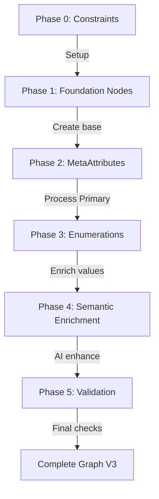
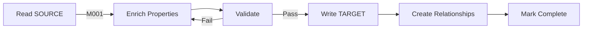
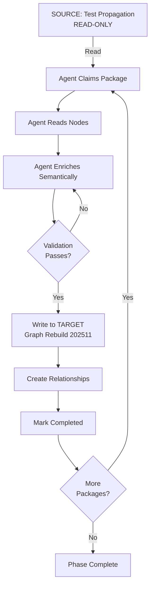

# Graph Migration Workflow Phases

**Purpose**: Detailed Phase 0-5 workflow for Neo4j graph semantic enrichment
**Version**: 1.0
**Last Updated**: 2025-11-24

---

## Overview: Phased Migration Process

The graph migration follows a strict 6-phase process ensuring systematic enrichment from SOURCE (Test Propagation) to TARGET (Graph Rebuild 202511).



---

## Phase 0: Database Preparation

**Purpose**: Set up TARGET database with V3 constraints and validation rules

### Steps

1. **Create TARGET database instance**
   ```bash
   # Neo4j Aura: Create new "Graph Rebuild 202511" instance
   # Record connection URI and credentials
   ```

2. **Apply Neo4j constraints**
   ```cypher
   // Unique constraints
   CREATE CONSTRAINT unique_metaattribute_id IF NOT EXISTS
   ON (m:MetaAttribute) ASSERT m.id IS UNIQUE;

   CREATE CONSTRAINT unique_enumeration_id IF NOT EXISTS
   ON (e:Enumeration) ASSERT e.id IS UNIQUE;

   CREATE CONSTRAINT unique_groupnode_id IF NOT EXISTS
   ON (g:GroupNode) ASSERT g.id IS UNIQUE;

   // Property existence constraints
   CREATE CONSTRAINT metaattribute_has_name IF NOT EXISTS
   ON (m:MetaAttribute) ASSERT m.nameDe IS NOT NULL;
   ```

3. **Initialize enrichment tracking**
   ```cypher
   // Add enrichment_status to all nodes
   MATCH (m:MetaAttribute)
   SET m.enrichment_status = 'unclaimed',
       m.claimed_at = null,
       m.completed_at = null,
       m.error_message = null
   ```

### Success Criteria
- [ ] TARGET database created and accessible
- [ ] All constraints applied successfully
- [ ] Enrichment status properties initialized
- [ ] SOURCE database verified as read-only

---

## Phase 1: Foundation Nodes

**Purpose**: Create structural skeleton (MetaScopes, Layers, GroupNodes)

### Node Creation Order

1. **MetaScopes** (2 nodes)
   ```cypher
   CREATE (ps:MetaScope {
     id: 'primary_scope',
     nameDe: 'WER WIR SIND',
     nameEn: 'WHO WE ARE',
     descriptionDe: 'Strategische Markenidentität',
     descriptionEn: 'Strategic Brand Identity'
   })

   CREATE (ss:MetaScope {
     id: 'secondary_scope',
     nameDe: 'WIE WIR ARBEITEN',
     nameEn: 'HOW WE EXECUTE',
     descriptionDe: 'Operative Umsetzung',
     descriptionEn: 'Operational Framework'
   })
   ```

2. **Layers** (8 nodes: 4 Primary + 4 Secondary)
   ```cypher
   // Primary Layers
   CREATE (l1:Layer {
     id: 'foundation',
     nameDe: 'Fundament',
     nameEn: 'Foundation',
     layerOrder: 0
   })
   // ... strategy, identity, expression
   ```

3. **GroupNodes** (48 nodes)
   ```cypher
   CREATE (g:GroupNode {
     id: 'brand_core',
     nameDe: 'Markenkern',
     nameEn: 'Brand Core',
     descriptionDe: 'Zentrale Identitätselemente',
     descriptionEn: 'Core identity elements'
   })
   ```

### Relationship Creation

```cypher
// MetaScope → Layer
MATCH (ms:MetaScope {id: 'primary_scope'}),
      (l:Layer {id: 'foundation'})
CREATE (ms)-[:HAS_LAYER]->(l)
```

### Success Criteria
- [ ] 2 MetaScopes created
- [ ] 8 Layers created with correct layerOrder
- [ ] 48 GroupNodes created with semantic names
- [ ] HAS_LAYER relationships connected

---

## Phase 2: MetaAttribute Migration

**Purpose**: Migrate all 259 MetaAttributes from SOURCE to TARGET

### Workflow



### Processing Steps

1. **Read from SOURCE**
   ```python
   source_db = SourceDB(SOURCE_URI, auth)
   source_node = source_db.read_node("M001", response_format="detailed")
   ```

2. **Enrich semantically**
   ```python
   enriched = {
       "nameDe": source_node["nameDe"],  # Preserve
       "definitionDe": generate_definition(source_node),  # AI enrichment
       "whatItIsDe": generate_characteristics(source_node),
       "whatItIsNotDe": generate_contrast(source_node),
       "brandingRelevanceDe": generate_relevance(source_node)
   }
   ```

3. **Validate before write**
   ```python
   validation = validate_metaattribute_properties(enriched)
   if not validation.overall_passed:
       # Regenerate with feedback
       enriched = regenerate_with_guidance(validation.suggestions)
   ```

4. **Write to TARGET**
   ```python
   target_db = TargetDB(TARGET_URI, auth)
   result = target_db.enrich_metaattribute(
       source_id="M001",
       enriched_properties=enriched,
       layer_id="foundation",
       group_id="brand_core",
       assignment_reasoning="...",
       grouping_reasoning="..."
   )
   ```

### Package-Based Processing

```python
# Process in batches of 25 MetaAttributes
for batch in chunks(metaattributes, 25):
    process_metaattribute_batch(batch)
    validate_batch_completion(batch)
```

### Success Criteria
- [ ] All 259 MetaAttributes migrated
- [ ] All semantic properties populated
- [ ] No template phrases detected
- [ ] HAS_ATTRIBUTE relationships created
- [ ] BELONGS_TO_GROUP relationships created

---

## Phase 3: Enumeration Migration

**Purpose**: Migrate all 3,255 Enumerations with semantic enrichment

### Critical: ALL Enumerations Per MetaAttribute

```python
# WRONG: Processing only first 20
enumerations = read_enumerations(meta_id, limit=20)  # ❌

# RIGHT: Claiming ALL Enumerations
package = claimer.claim_package(meta_id)
# If MetaAttribute has 35 Enumerations, package has ALL 35!
for enum_id in package.enumeration_ids:  # ✅ ALL included
    process_enumeration(enum_id)
```

### Processing Workflow

1. **Package-based claiming**
   ```python
   claimer = PackageClaimer(target_db)
   packages = claimer.claim_packages("Agent_A1", num_packages=2)

   for package in packages:
       # Process MetaAttribute first
       enrich_metaattribute(package.meta_id)

       # Then ALL its Enumerations
       for enum_id in package.enumeration_ids:
           enrich_enumeration(enum_id, package.meta_id)
   ```

2. **Enumeration enrichment**
   ```python
   def enrich_enumeration(source_enum_id, target_meta_id):
       # Read from SOURCE
       source = source_db.read_node(source_enum_id)

       # Generate semantic content
       enriched = {
           "nameDe": source["nameDe"],
           "definitionDe": generate_enum_definition(source),
           "whatItIsDe": generate_enum_characteristics(source),
           "whatItIsNotDe": generate_enum_contrast(source),
           "examplesDe": find_brand_examples(source)
       }

       # Write to TARGET
       result = target_db.enrich_enumeration(
           source_id=source_enum_id,
           enriched_properties=enriched,
           meta_attribute_id=target_meta_id
       )
   ```

### Hierarchieless ID Translation

```python
# Old V2 format: E-M001-001
# New V3 format: E-00001

def translate_enumeration_id(old_id):
    if old_id.startswith("E-M"):
        # Extract sequential number from mapping
        return id_mapping[old_id]  # Returns E-00042
    return old_id  # Already V3 format
```

### Success Criteria
- [ ] All 3,255 Enumerations migrated
- [ ] Hierarchieless IDs (E-00001 format) applied
- [ ] Semantic contrast in whatItIs/IsNot
- [ ] Brand examples where applicable
- [ ] HAS_ENUMERATION relationships created

---

## Phase 4: Semantic Enrichment

**Purpose**: AI-driven enhancement of all semantic properties

### Two-Pass Enrichment

#### Pass 1: Template Detection & Regeneration

```python
def detect_and_fix_templates():
    """Find and regenerate template phrases."""

    # Query all nodes
    nodes = target_db.query("""
        MATCH (m:MetaAttribute)
        RETURN m.id, m.definitionDe, m.definitionEn
    """)

    for node in nodes:
        if contains_template_phrase(node["definitionDe"]):
            # Regenerate without templates
            new_definition = generate_specific_definition(
                node_id=node["id"],
                avoid_phrases=BANNED_PHRASES_DE
            )

            # Update node
            target_db.update(
                node_id=node["id"],
                properties={"definitionDe": new_definition}
            )
```

#### Pass 2: Semantic Quality Enhancement

```python
def enhance_semantic_quality():
    """Improve definitions, add examples, ensure contrast."""

    for node in nodes_needing_enhancement():
        enhanced = {
            "definitionDe": expand_definition(node),
            "whatItIsDe": add_specific_characteristics(node),
            "whatItIsNotDe": strengthen_contrast(node),
            "brandingRelevanceDe": add_use_cases(node)
        }

        validate_and_update(node.id, enhanced)
```

### AI Agent Workflow

```python
# Agent reads skill documentation
agent.load_skill(".claude/skills/graph-semantic-enrichment/SKILL.md")

# Agent claims packages
packages = agent.claim_packages(2)

# For each package (3-Phasen Loop)
for package in packages:
    # Phase 1: Gather Context
    source_data = agent.read_source_nodes(package)

    # Phase 2: Take Action
    enriched_data = agent.generate_semantic_content(source_data)

    # Phase 3: Verify Work
    validation = agent.validate_enrichment(enriched_data)

    if validation.passed:
        agent.commit_enrichment(enriched_data)
    else:
        agent.regenerate_with_feedback(validation.suggestions)
```

### Success Criteria
- [ ] Zero template phrases remaining
- [ ] All definitions 200-600 chars
- [ ] All whatItIs lists have 3-7 specific items
- [ ] Semantic contrast verified
- [ ] Brand examples added where applicable

---

## Phase 5: Final Validation

**Purpose**: Comprehensive validation of complete graph

### Validation Checks

#### 1. Structural Integrity

```cypher
// All MetaAttributes have Layer assignment
MATCH (m:MetaAttribute)
WHERE NOT (m)<-[:HAS_ATTRIBUTE]-(:Layer)
RETURN count(m) as orphaned_metaattributes

// All Enumerations have parent MetaAttribute
MATCH (e:Enumeration)
WHERE NOT (e)<-[:HAS_ENUMERATION]-(:MetaAttribute)
RETURN count(e) as orphaned_enumerations

// No backward DETERMINES edges
MATCH (m1:MetaAttribute)-[:DETERMINES]->(m2:MetaAttribute)
MATCH (m1)<-[:HAS_ATTRIBUTE]-(l1:Layer),
      (m2)<-[:HAS_ATTRIBUTE]-(l2:Layer)
WHERE l1.layerOrder > l2.layerOrder
RETURN count(*) as backward_edges
```

#### 2. Semantic Completeness

```cypher
// Check all properties populated
MATCH (m:MetaAttribute)
WHERE m.definitionDe IS NULL
   OR size(m.definitionDe) < 200
   OR m.whatItIsDe IS NULL
   OR size(m.whatItIsDe) < 3
RETURN m.id, "Incomplete properties" as issue

// Detect remaining template phrases
MATCH (m:MetaAttribute)
WHERE m.definitionDe CONTAINS "Ein fundamentaler Aspekt"
   OR m.definitionDe CONTAINS "Bezieht sich auf"
RETURN m.id, "Template phrase detected" as issue
```

#### 3. ID Translation Verification

```cypher
// Verify hierarchieless IDs
MATCH (e:Enumeration)
WHERE e.id CONTAINS "E-M"  // Old format
RETURN count(e) as old_format_ids

// Check IDMapping completeness
MATCH (m:IDMapping)
RETURN m.nodeType, count(m) as mapped_count
ORDER BY m.nodeType
```

#### 4. Progress Tracking

```cypher
// Enrichment status summary
MATCH (m:MetaAttribute)
RETURN m.enrichment_status, count(m) as count
ORDER BY m.enrichment_status

// Should show:
// completed: 259
// failed: 0
// in_progress: 0
// claimed: 0
// unclaimed: 0
```

### Manual Spot Checks

1. **Sample 10 MetaAttributes** - Read definitions, verify quality
2. **Sample 20 Enumerations** - Check contrast (whatItIs vs whatItIsNot)
3. **Review failed nodes** - Understand why validation failed
4. **Test relationships** - Verify DETERMINES/INTERACTS logic

### Success Criteria
- [ ] Zero orphaned nodes
- [ ] Zero backward DETERMINES edges
- [ ] All properties within length requirements
- [ ] No template phrases detected
- [ ] All nodes show 'completed' status
- [ ] IDMapping preserved for traceability
- [ ] Manual review confirms quality

---

## Workflow Summary



## Time Estimates

| Phase | Duration | Parallelization |
|-------|----------|-----------------|
| Phase 0 | 30 min | N/A |
| Phase 1 | 1 hour | N/A |
| Phase 2 | 4-6 hours | 8 agents |
| Phase 3 | 8-10 hours | 8 agents |
| Phase 4 | 4-6 hours | 8 agents |
| Phase 5 | 1 hour | N/A |
| **Total** | **18-24 hours** | With 8 agents |

---

## Key Principles

1. **SOURCE is immutable** - Never write to Test Propagation
2. **TARGET is validated** - Only write quality content
3. **Package-based claiming** - ALL Enumerations included
4. **Two-tier validation** - Structure + semantic quality
5. **Hierarchieless IDs** - Sequential, not hierarchical
6. **Traceability preserved** - IDMapping for audit
7. **Template phrases banned** - Regenerate if detected
8. **3-Phasen Loop** - Gather → Act → Verify
9. **Progressive enrichment** - Foundation → Expression
10. **Parallel safe** - 8 agents without conflicts

---

**Remember**: This is a one-time migration. Quality matters more than speed. SOURCE → TARGET is unidirectional.